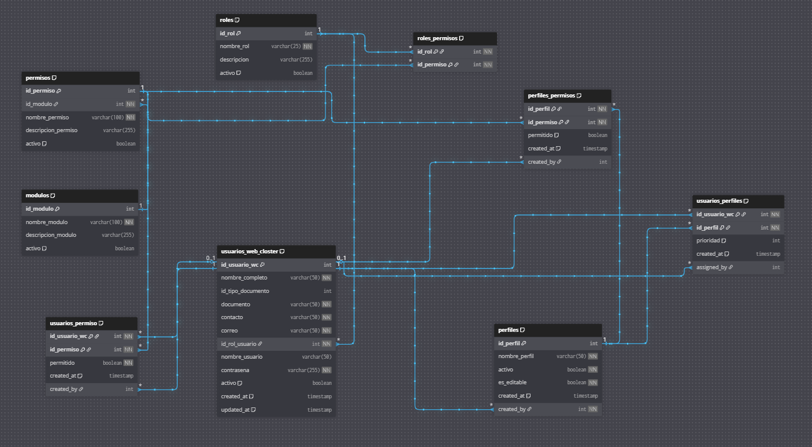
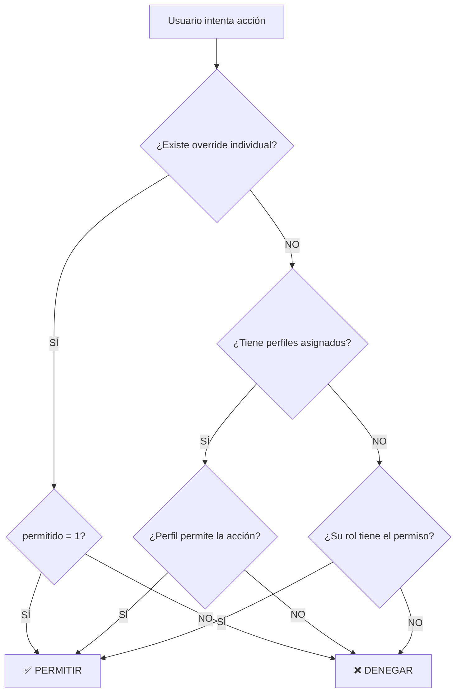

# RBAC (Control de Acceso Basado en Roles)

ActivaMecodex implementa un sistema robusto de **Control de Acceso Basado en Roles (RBAC)** que permite gestionar de manera segura y granular los permisos de los usuarios dentro de la plataforma.

## 🎯 ¿Qué es RBAC?

RBAC es un modelo de seguridad que asigna permisos a usuarios basándose en sus roles dentro de una organización. En lugar de otorgar permisos individualmente a cada usuario, se definen **roles** con conjuntos específicos de permisos, y luego se asignan estos roles a los usuarios.

### Beneficios principales:

- ✅ **Seguridad**: Control preciso sobre quién puede acceder a qué recursos
- ✅ **Escalabilidad**: Fácil gestión de permisos para múltiples usuarios
- ✅ **Flexibilidad**: Personalización mediante perfiles y overrides individuales
- ✅ **Auditoría**: Trazabilidad completa de quién otorgó cada permiso

---

## 📊 Modelo Entidad-Relación



---

## 🏗️ Arquitectura del Sistema

ActivaMecodex utiliza una **jerarquía de 3 niveles** para determinar los permisos efectivos de cada usuario:
```
┌─────────────────────────────────────────┐
│  Nivel 3: OVERRIDES INDIVIDUALES        │  ← Mayor prioridad
│  (usuarios_permisos)                    │
│  Excepción específica por usuario       │
└─────────────────────────────────────────┘
                  ↓
┌─────────────────────────────────────────┐
│  Nivel 2: PERFILES PERSONALIZABLES      │  ← Prioridad media
│  (usuarios_perfiles + perfiles_permisos)│
│  Plantillas reutilizables de permisos   │
└─────────────────────────────────────────┘
                  ↓
┌─────────────────────────────────────────┐
│  Nivel 1: ROL BASE                      │  ← Menor prioridad
│  (roles_permisos)                       │
│  Permisos heredados automáticamente     │
└─────────────────────────────────────────┘
```

### ¿Cómo funciona la jerarquía?

Cuando el sistema evalúa si un usuario tiene un permiso específico, verifica en este orden:

1. **¿Existe un override individual?** → Si existe, ese es el valor definitivo
2. **¿Tiene perfiles asignados?** → Si existe, usa el permiso del perfil de mayor prioridad
3. **¿Qué permisos tiene su rol base?** → Si no hay override ni perfil, usa el permiso del rol
4. **Si no existe en ningún lado** → El permiso es **DENEGADO** por defecto

---

## 📚 Tablas del Sistema

### 1. usuarios_web_closter

**Descripción**: Tabla principal que almacena todos los usuarios del sistema ActivaMecodex.

**Campos principales**:
- `id_usuario_wc`: Identificador único del usuario
- `nombre_completo`: Nombre completo del usuario
- `correo`: Email para autenticación
- `id_rol_usuario`: Rol base asignado (FK → roles)
- `activo`: Estado del usuario (activo/inactivo)

**Ejemplo**:
```sql
-- Usuario administrador
id_usuario_wc: 1
nombre_completo: "Jhoan David Sinisterra Valencia"
correo: "sinisterravalenciajhoandavid@gmail.com"
id_rol_usuario: 1  -- Rol: Administrador
activo: 1
```

:::tip Relación con RBAC
Cada usuario **hereda automáticamente** los permisos de su rol base definido en `id_rol_usuario`.
:::

---

### 2. roles

**Descripción**: Catálogo de roles disponibles en el sistema. Define grupos de usuarios con permisos similares.

**Campos principales**:
- `id_rol`: Identificador único del rol
- `nombre_rol`: Nombre descriptivo (ej: "Administrador", "Soporte")
- `descripcion`: Explicación del propósito del rol
- `activo`: Estado del rol

**Roles predefinidos en ActivaMecodex**:

| ID | Nombre | Descripción | Permisos |
|----|--------|-------------|----------|
| 1 | Administrador | Control total del sistema | 9 permisos (todos) |
| 2 | Soporte | Gestión de clientes | 4 permisos básicos |

**Ejemplo de uso**:
```sql
-- Rol de Soporte Técnico
id_rol: 2
nombre_rol: "Soporte"
descripcion: "Usuario de soporte técnico, gestiona clientes de Mecodex"
activo: 1
```

:::info Buena práctica
Los roles deben representar **funciones reales** en tu organización (ej: Gerente de Ventas, Auditor, Operador).
:::

---

### 3. modulos

**Descripción**: Representa las secciones principales de la aplicación. Cada módulo agrupa funcionalidades relacionadas.

**Campos principales**:
- `id_modulo`: Identificador único
- `nombre_modulo`: Nombre de la sección (ej: "Clientes", "Usuarios")
- `descripcion_modulo`: Explicación de la funcionalidad
- `activo`: Estado del módulo

**Módulos actuales**:

| ID | Módulo | Descripción |
|----|--------|-------------|
| 1 | Clientes | Gestión de clientes Mecodex (CRUD completo) |
| 2 | Usuarios WebCloster | Administración de usuarios del sistema |
| 3 | Inicio | Dashboard con métricas y gráficos |

**Ejemplo**:
```sql
id_modulo: 1
nombre_modulo: "Clientes"
descripcion_modulo: "Gestión completa de clientes Mecodex"
activo: 1
```

---

### 4. permisos

**Descripción**: Define las **acciones específicas** que se pueden realizar dentro de cada módulo.

**Campos principales**:
- `id_permiso`: Identificador único
- `id_modulo`: Módulo al que pertenece (FK → modulos)
- `nombre_permiso`: Nombre en formato `modulo.accion` (ej: `clientes.crear`)
- `descripcion_permiso`: Explicación de la acción
- `activo`: Estado del permiso

**Convención de nombres**: `{modulo}.{accion}`

**Permisos disponibles**:

| ID | Módulo | Nombre | Descripción |
|----|--------|--------|-------------|
| 1 | Clientes | `clientes.ver` | Ver listado de clientes |
| 2 | Clientes | `clientes.crear` | Crear nuevos clientes |
| 3 | Clientes | `clientes.editar` | Modificar clientes existentes |
| 4 | Clientes | `clientes.eliminar` | Eliminar clientes |
| 5 | Usuarios | `usuarios.ver` | Ver lista de usuarios del sistema |
| 6 | Usuarios | `usuarios.crear` | Crear nuevos usuarios |
| 7 | Usuarios | `usuarios.editar` | Editar usuarios existentes |
| 8 | Usuarios | `usuarios.suspender` | Suspender acceso de usuarios |
| 9 | Inicio | `inicio.ver` | Acceder al dashboard |

**Ejemplo**:
```sql
id_permiso: 2
id_modulo: 1  -- Módulo "Clientes"
nombre_permiso: "clientes.crear"
descripcion_permiso: "Crear nuevos clientes"
activo: 1
```

:::caution Importante
Los permisos son **granulares**. No confundas `clientes.ver` con `clientes.editar` - son acciones independientes.
:::

---

### 5. roles_permisos

**Descripción**: Tabla intermedia que define qué permisos tiene **cada rol por defecto**. Todos los usuarios de un rol heredan estos permisos automáticamente.

**Campos principales**:
- `id_rol`: Rol al que se asigna el permiso (FK → roles)
- `id_permiso`: Permiso asignado (FK → permisos)

**Llave primaria compuesta**: `(id_rol, id_permiso)`

**Ejemplo de configuración actual**:
```sql
-- Rol Administrador (id=1) tiene TODOS los permisos
INSERT INTO roles_permisos (id_rol, id_permiso) VALUES
(1, 1), (1, 2), (1, 3), (1, 4),  -- Clientes: ver, crear, editar, eliminar
(1, 5), (1, 6), (1, 7), (1, 8),  -- Usuarios: ver, crear, editar, suspender
(1, 9);                           -- Inicio: ver

-- Rol Soporte (id=2) tiene permisos limitados
INSERT INTO roles_permisos (id_rol, id_permiso) VALUES
(2, 1), (2, 2), (2, 3),  -- Clientes: ver, crear, editar (NO eliminar)
(2, 9);                   -- Inicio: ver (SIN acceso a usuarios)
```

**Visualización**:

| Permiso | Administrador | Soporte |
|---------|---------------|---------|
| clientes.ver | ✅ | ✅ |
| clientes.crear | ✅ | ✅ |
| clientes.editar | ✅ | ✅ |
| clientes.eliminar | ✅ | ❌ |
| usuarios.ver | ✅ | ❌ |
| usuarios.crear | ✅ | ❌ |
| usuarios.editar | ✅ | ❌ |
| usuarios.suspender | ✅ | ❌ |
| inicio.ver | ✅ | ✅ |

:::tip Herencia automática
Cuando asignas el rol "Soporte" a un usuario, **automáticamente** obtiene los 4 permisos definidos en esta tabla.
:::

---

### 6. perfiles

**Descripción**: Contenedores **reutilizables** de permisos personalizados. Permiten crear configuraciones específicas que pueden asignarse a múltiples usuarios sin modificar sus roles base.

**Campos principales**:
- `id_perfil`: Identificador único
- `nombre_perfil`: Nombre descriptivo (ej: "Auditor Avanzado")
- `descripcion`: Explicación del propósito del perfil
- `activo`: Estado del perfil
- `es_editable`: Si el perfil puede ser modificado
- `created_by`: Usuario que creó el perfil (FK → usuarios_web_closter)

**¿Cuándo usar perfiles?**

✅ **Usa perfiles cuando**:
- Necesitas la misma configuración de permisos para **varios usuarios**
- Quieres crear "plantillas" reutilizables
- Los permisos del rol base no son suficientes ni excesivos

❌ **NO uses perfiles cuando**:
- Solo un usuario necesita el cambio → usa **override individual**

**Ejemplo de perfil**:
```sql
id_perfil: 1
nombre_perfil: "Auditor Avanzado"
descripcion: "Puede ver todo y crear clientes, pero no modificar ni eliminar"
activo: 1
es_editable: 1
created_by: 1  -- Creado por Jhoan
```

**Caso de uso real**:

Imagina que tienes **10 empleados nuevos** que necesitan:
- Ver clientes y usuarios
- Crear clientes
- NO editar ni eliminar nada

En lugar de hacer 10 overrides individuales, creas **1 perfil** y lo asignas a los 10 usuarios.

---

### 7. perfiles_permisos

**Descripción**: Tabla intermedia que define qué permisos están **habilitados o denegados** en cada perfil.

**Campos principales**:
- `id_perfil`: Perfil al que pertenece (FK → perfiles)
- `id_permiso`: Permiso asociado (FK → permisos)
- `permitido`: `1` = conceder, `0` = denegar
- `created_by`: Usuario que configuró el permiso

**Llave primaria compuesta**: `(id_perfil, id_permiso)`

**Ejemplo de configuración del perfil "Auditor Avanzado"**:
```sql
-- Perfil "Auditor Avanzado" (id=1)
INSERT INTO perfiles_permisos (id_perfil, id_permiso, permitido, created_by) VALUES
(1, 1, 1, 1),  -- ✅ clientes.ver = PERMITIDO
(1, 2, 1, 1),  -- ✅ clientes.crear = PERMITIDO
(1, 3, 0, 1),  -- ❌ clientes.editar = DENEGADO
(1, 4, 0, 1),  -- ❌ clientes.eliminar = DENEGADO
(1, 5, 1, 1),  -- ✅ usuarios.ver = PERMITIDO
(1, 9, 1, 1);  -- ✅ inicio.ver = PERMITIDO
```

:::warning Importante
Si un permiso no está en esta tabla, el perfil **NO lo otorga**. Solo incluye los permisos que quieres controlar.
:::

---

### 8. usuarios_perfiles

**Descripción**: Asigna **perfiles** a usuarios específicos. Un usuario puede tener múltiples perfiles con diferentes prioridades.

**Campos principales**:
- `id_usuario_wc`: Usuario al que se asigna (FK → usuarios_web_closter)
- `id_perfil`: Perfil asignado (FK → perfiles)
- `prioridad`: Número que define precedencia (mayor = más importante)
- `assigned_by`: Usuario que hizo la asignación

**Llave primaria compuesta**: `(id_usuario_wc, id_perfil)`

**¿Cómo funciona la prioridad?**

Si un usuario tiene **2 perfiles** que definen el mismo permiso de forma diferente, gana el de **mayor prioridad**.

**Ejemplo**:
```sql
-- Usuario root (id=2) recibe perfil "Auditor Avanzado"
INSERT INTO usuarios_perfiles (id_usuario_wc, id_perfil, prioridad, assigned_by) VALUES
(2, 1, 1, 1);  -- root obtiene perfil 1, prioridad 1, asignado por Jhoan

-- Usuario David (id=10) también recibe el mismo perfil
INSERT INTO usuarios_perfiles (id_usuario_wc, id_perfil, prioridad, assigned_by) VALUES
(10, 1, 1, 1);
```

**Caso con múltiples perfiles y prioridades**:
```sql
-- Usuario María tiene 2 perfiles
INSERT INTO usuarios_perfiles (id_usuario_wc, id_perfil, prioridad) VALUES
(5, 1, 1),  -- Perfil "Auditor" (prioridad 1) → clientes.eliminar = NO
(5, 2, 2);  -- Perfil "Gerente" (prioridad 2) → clientes.eliminar = SÍ

-- Resultado: María SÍ puede eliminar clientes porque el perfil de prioridad 2 gana
```

:::info Buena práctica
Usa prioridades solo cuando realmente necesites múltiples perfiles. Para la mayoría de casos, **un perfil por usuario** es suficiente.
:::

---

### 9. usuarios_permisos

**Descripción**: Tabla de **overrides individuales**. Permite conceder o revocar permisos específicos a un usuario sin cambiar su rol ni perfil. Tiene la **máxima prioridad** en la jerarquía.

**Campos principales**:
- `id_usuario_wc`: Usuario afectado (FK → usuarios_web_closter)
- `id_permiso`: Permiso a modificar (FK → permisos)
- `permitido`: `1` = conceder, `0` = revocar
- `created_by`: Usuario que otorgó/revocó el permiso

**Llave primaria compuesta**: `(id_usuario_wc, id_permiso)`

**¿Cuándo usar overrides?**

✅ **Usa overrides cuando**:
- Un solo usuario necesita una excepción temporal
- El cambio es muy específico y no justifica crear un perfil
- Necesitas revocar un permiso que el rol/perfil otorga

**Ejemplos de uso**:
```sql
-- CASO 1: Conceder permiso que el rol NO tiene
-- Usuario root (Soporte) necesita suspender usuarios temporalmente
INSERT INTO usuarios_permisos (id_usuario_wc, id_permiso, permitido, created_by) VALUES
(2, 8, 1, 1);  -- ✅ root PUEDE suspender usuarios (aunque su rol no lo permite)

-- CASO 2: Revocar permiso que el rol SÍ tiene
-- Usuario Jhoan (Admin) NO debe poder eliminar clientes
INSERT INTO usuarios_permisos (id_usuario_wc, id_permiso, permitido, created_by) VALUES
(1, 4, 0, 1);  -- ❌ Jhoan NO PUEDE eliminar clientes (aunque es admin)

-- CASO 3: Combinación con perfiles
-- Usuario David tiene perfil "Auditor" pero NO puede crear clientes
INSERT INTO usuarios_permisos (id_usuario_wc, id_permiso, permitido, created_by) VALUES
(10, 2, 0, 1);  -- ❌ David NO PUEDE crear clientes (override supera al perfil)
```

:::danger Prioridad máxima
Si existe un registro en `usuarios_permisos`, ese valor es **DEFINITIVO**. No importa qué diga el rol o el perfil.
:::

---

## 🔍 Ejemplos Prácticos

### Ejemplo 1: Usuario con solo rol base

**Usuario**: root (id=2)  
**Rol**: Soporte  
**Perfil**: Ninguno  
**Overrides**: Ninguno  

**Permisos efectivos**:
```
✅ clientes.ver        (del rol Soporte)
✅ clientes.crear      (del rol Soporte)
✅ clientes.editar     (del rol Soporte)
❌ clientes.eliminar   (rol Soporte no lo tiene)
❌ usuarios.*          (rol Soporte no tiene acceso)
✅ inicio.ver          (del rol Soporte)
```

---

### Ejemplo 2: Usuario con rol + perfil

**Usuario**: root (id=2)  
**Rol**: Soporte  
**Perfil**: "Auditor Avanzado" (id=1)  
**Overrides**: Ninguno  

**¿Qué permisos tiene?**

1. **Hereda del rol Soporte**: `clientes.ver`, `clientes.crear`, `clientes.editar`, `inicio.ver`
2. **Hereda del perfil**: `clientes.ver`, `clientes.crear` (NO editar), `usuarios.ver`, `inicio.ver`

**Conflicto**: El rol permite `clientes.editar` pero el perfil lo NIEGA.

**Resolución**: Gana el **perfil** (nivel 2) sobre el rol (nivel 1).

**Permisos efectivos**:
```
✅ clientes.ver        (rol + perfil)
✅ clientes.crear      (rol + perfil)
❌ clientes.editar     (perfil lo deniega, supera al rol)
❌ clientes.eliminar   (ni rol ni perfil lo tienen)
✅ usuarios.ver        (del perfil)
❌ usuarios.crear      (ni rol ni perfil lo tienen)
✅ inicio.ver          (rol + perfil)
```

---

### Ejemplo 3: Usuario con rol + perfil + override

**Usuario**: root (id=2)  
**Rol**: Soporte  
**Perfil**: "Auditor Avanzado"  
**Override**: `usuarios.suspender = 1` (CONCEDIDO)  

**Permisos efectivos**:
```
✅ clientes.ver        (rol + perfil)
✅ clientes.crear      (rol + perfil)
❌ clientes.editar     (perfil lo deniega)
❌ clientes.eliminar   (ni rol ni perfil lo tienen)
✅ usuarios.ver        (del perfil)
✅ usuarios.suspender  (OVERRIDE individual - máxima prioridad)
✅ inicio.ver          (rol + perfil)
```

:::tip Jerarquía en acción
El override `usuarios.suspender = 1` **supera** el hecho de que ni el rol ni el perfil lo permiten.
:::

---

### Ejemplo 4: Administrador con restricción

**Usuario**: Jhoan (id=1)  
**Rol**: Administrador  
**Perfil**: Ninguno  
**Override**: `clientes.eliminar = 0` (REVOCADO)  

**Permisos efectivos**:
```
✅ clientes.ver        (del rol Admin)
✅ clientes.crear      (del rol Admin)
✅ clientes.editar     (del rol Admin)
❌ clientes.eliminar   (OVERRIDE lo revoca - máxima prioridad)
✅ usuarios.*          (del rol Admin)
✅ inicio.ver          (del rol Admin)
```

**Interpretación**:  
Jhoan es administrador pero explícitamente **NO puede eliminar clientes** debido al override individual.

---

## 🚀 Flujo de Validación de Permisos

Cuando un usuario intenta realizar una acción, el sistema valida en este orden:


---

## 📋 Buenas Prácticas

### ✅ Recomendaciones

1. **Usa roles para permisos comunes**: Define roles que representen funciones reales en tu empresa
2. **Usa perfiles para grupos de usuarios**: Si 5+ usuarios necesitan los mismos permisos especiales, crea un perfil
3. **Usa overrides para excepciones**: Solo para casos únicos o temporales
4. **Documenta los cambios**: Usa el campo `created_by` para saber quién modificó cada permiso
5. **Revisa periódicamente**: Audita los overrides para detectar permisos obsoletos

### ❌ Evita

1. **No abuses de los overrides**: Si muchos usuarios necesitan el mismo cambio, crea un perfil o ajusta el rol
2. **No crees roles demasiado específicos**: Mejor usa perfiles para casos especiales
3. **No mezcles perfiles conflictivos**: Si asignas múltiples perfiles, asegúrate de que no se contradigan
4. **No olvides desactivar usuarios**: Usa el campo `activo` en lugar de eliminar registros

---

## 🔒 Consideraciones de Seguridad

1. **Principio de mínimo privilegio**: Otorga solo los permisos necesarios
2. **Auditoría**: Todos los cambios quedan registrados con `created_by` y `created_at`
3. **Roles críticos**: El rol Administrador debe asignarse con extremo cuidado
4. **Revisiones periódicas**: Audita permisos al menos cada 6 meses
5. **Desactivación vs eliminación**: Desactiva usuarios en lugar de eliminarlos para mantener el historial

---

## 📝 Resumen

ActivaMecodex implementa un sistema RBAC robusto con **3 niveles jerárquicos**:

1. **Rol base**: Permisos predeterminados según la función del usuario
2. **Perfiles**: Plantillas reutilizables para grupos de usuarios con necesidades similares
3. **Overrides individuales**: Excepciones específicas con máxima prioridad

Esta arquitectura permite:
- ✅ Gestión segura y escalable de permisos
- ✅ Flexibilidad para casos especiales
- ✅ Auditoría completa de cambios
- ✅ Control granular a nivel de acción (ver, crear, editar, eliminar)

---

## 🆘 Soporte

Para más información sobre cómo configurar permisos o resolver dudas específicas, contacta al equipo de desarrollo de ActivaMecodex.