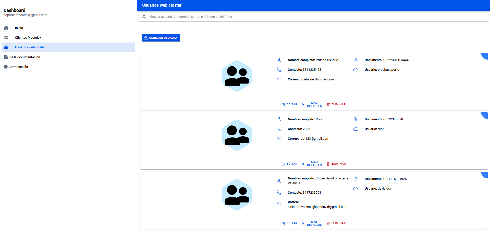
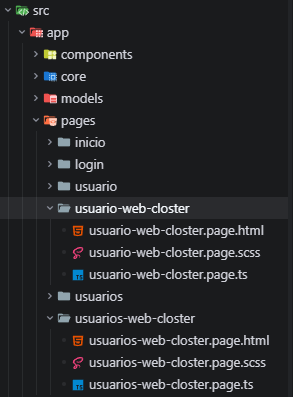
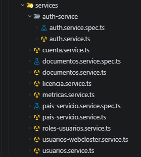

# Detalles técnicos del frontend: ActivaMecodex

> Para una visión general del proyecto, consulta el [documento oficial](./documento-oficial-ActivaMecodex.md).

## Tecnologías principales del frontend

- **Angular 20** con componentes standalone
- **Ionic Angular 8** para componentes UI
- **RxJS** para manejo de Observables
- **Entornos configurables** en `src/environments`

## Arquitectura frontend: Zoneless y Signals

ActivaMecodex está construida sin Zone.js y aprovecha el modo [Zoneless](https://v20.angular.dev/guide/zoneless) de Angular, lo que reduce sobrecarga y mejora el rendimiento. Además, utiliza Signals para manejar el estado de forma reactiva y precisa, asegurando actualizaciones rápidas y controladas en la interfaz sin procesos innecesarios.

## Rutas y Navegación (`src/app/app.routes.ts`)

| Ruta | Descripción | Componente |
|------|-------------|------------|
| `/` | Redirección automática | → `/inicio` |
| `/inicio` | Página de inicio | `InicioPage` |
| `/usuarios` | Listado de usuarios | `UsuariosPage` |
| `/usuario/:id` | Detalle de usuario específico | `UsuarioPage` |
| `/usuarios-web-closter` | Listado de usuarios de webcloster | `UsuariosWebClosterPage` |
| `/usuarios-web-closter/:id` | Detalle de usuario específico de webcloster | `UsuarioWebClosterPage` |
| `**` | Ruta no reconocida | → `/inicio` |

## Páginas 📄

### 1. InicioPage

**Propósito:** Página de inicio con gráficos de métricas generales usando ApexCharts.

**Características:**
- Gráficas de barras, líneas, pie, etc., separadas en componentes standalone en `src/app/components/charts/`.
- Cada gráfica se configura con opciones específicas y se actualiza dinámicamente con datos de clientes, planes, países y evolución mensual.

#### Visualización de gráficas

#### Estructura de carpetas de gráficas

### 2. UsuariosPage

**Propósito:** Listado de clientes con búsqueda, conteos por plan, carga incremental y CRUD completo (registrar, editar, eliminar).

**Nota:** Aunque se llama "UsuariosPage", maneja clientes de Mecodex.

#### Visualización:

### 3. UsuarioPage

**Propósito:** Detalle de un cliente específico, con dos vistas segmentadas: *Cliente* (datos personales) y *Cuenta* (información de cuenta Mecodex).

#### Visualización:

#### Estructura de componentes CRUD

### 4. UsuariosWebClosterPage

**Propósito:** Listado de usuarios de webcloster con búsqueda, carga incremental y CRUD completo (registrar, editar, eliminar). Este modulo solo puede ser accedido por usuarios con rol de administrador. Esto porque solo dicho usuario tiene permisos para gestionar los usuarios de webcloster.

#### Visualización:

#### Estructura de carpetas para la página de usuarios de webcloster:

---

## Servicios 🖥

**Propósito:** Proveer servicios HTTP para interactuar con las APIs del backend, gestionando usuarios, autenticación JWT, datos de clientes y métricas. Estos servicios se encargan de realizar solicitudes HTTP a la API, manejar respuestas y errores mediante RxJS, y proporcionar estado reactivo usando Signals de Angular.

### Categorías de Servicios

#### 1. **Autenticación y Autorización**
- **`AuthService`** (`auth-service/auth.service.ts`)
  - Maneja login con JWT (JSON Web Token)
  - Almacena y valida tokens en `localStorage`
  - Gestiona el estado de sesión del usuario autenticado
  - Verifica roles (Administrador, Soporte) para control de acceso
  - Proporciona métodos: `loginUsuarioService()`, `isAutenthicate()`, `getCurrentUser()`, `getCurrentUserRole()`, `hasRole()`, `logOut()`

#### 2. **Gestión de Usuarios**
- **`UsuariosService`** (`usuarios.service.ts`)
  - CRUD completo de clientes Mecodex
  - Métodos: `getUsuarios()`, `createUser()`, `updateUser()`, `deleteUser()`
  - Consume endpoint principal de clientes

- **`UsuariosWebClosterService`** (`usuarios-webcloster.service.ts`)
  - CRUD de usuarios del sistema (solo accesible por administradores)
  - Métodos: `getUsuariosWebCloster()`, `createUsuariosWebCloster()`, `updateUsuariosWebCloster()`, `deleteUsuarioWebCloster()`

#### 3. **Datos de Cliente y Configuración**
- **`CuentaService`** (`cuenta.service.ts`)
  - Gestiona cuentas Mecodex asociadas a clientes
  - Métodos: `getCuenta()`, `createCuenta()`, `updateCuentaLicencia()`
  - Almacena en signal el ID de licencia seleccionada

- **`LicenciaService`** (`licencia.service.ts`)
  - Obtiene y almacena listado de licencias disponibles
  - Usa signal reactivo para el estado de licencias
  - Método: `getLicenciasService()`

- **`PaisServicioService`** (`pais-servicio.service.ts`)
  - Obtiene catálogo de países para formularios
  - Método: `getPaises()`

- **`DocumentosService`** (`documentos.service.ts`)
  - Obtiene tipos de documentos (CC, CE, etc.)
  - Método: `getDocuments()`

- **`RolesUsuariosService`** (`roles-usuarios.service.ts`)
  - Obtiene catálogo de roles del sistema
  - Método: `getRoles()`

#### 4. **Métricas y Dashboard**
- **`MetricasService`** (`metricas.service.ts`)
  - Provee datos para las gráficas del dashboard
  - Métodos especializados:
    - `getMetricasGenerales()` - Total de clientes
    - `getMetricasPlanes()` - Distribución por plan
    - `getMetricasPaises()` - Clientes por país
    - `getMetricasEvolucion()` - Evolución mensual
  - Cada método consulta el mismo endpoint con parámetro `tipo` diferente

### Características Técnicas

- **Estado Reactivo:** Todos los servicios usan Signals para almacenar URLs de API y datos reactivos
- **Manejo de Errores:** Implementan `catchError` de RxJS para capturar y propagar errores HTTP
- **Transformación de Datos:** Usan operadores `map` para transformar respuestas de API a interfaces TypeScript
- **Variables de Entorno:** Todas las URLs de API se configuran desde `src/environments/environment.ts`
- **Inyección Singleton:** Todos los servicios usan `providedIn: 'root'` para una única instancia en la aplicación

#### Estructura de carpetas para los servicios:

## Notas técnicas adicionales

- **Estado Reactivo:** Señales (signals) para gestión de estado en páginas.
- **Carga Perezosa:** Rutas con componentes standalone cargados bajo demanda.
- **Experiencia de Usuario:** Infinite Scroll en listados para carga progresiva.
- **Arquitectura:** Separación clara entre componentes, servicios y modelos.

---

*Documentación técnica frontend por Jhoan David Sinisterra. - Made with ❤️ -*