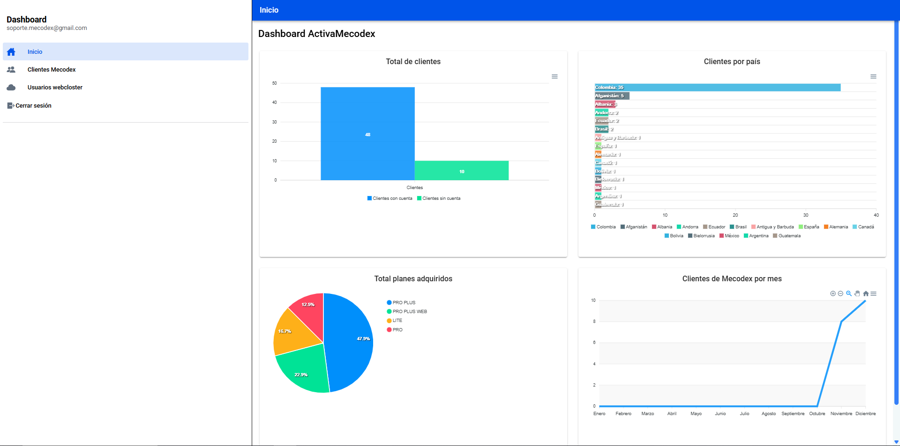
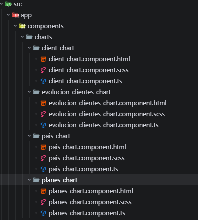
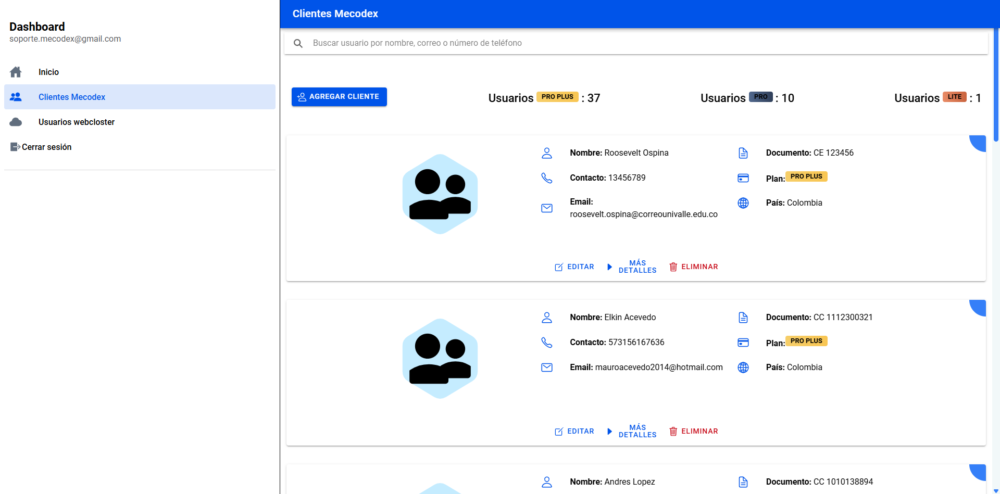
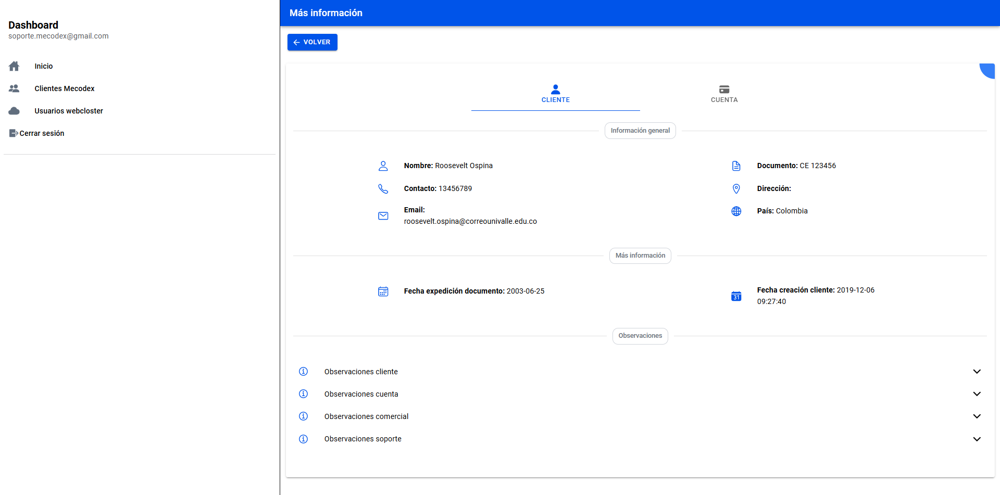
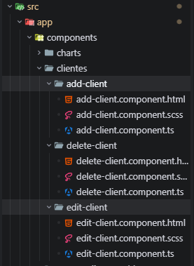

# Detalles técnicos del frontend: ActivaMecodex

> Para una visión general del proyecto, consulta el [documento oficial](./documento-oficial-ActivaMecodex.md).

## Tecnologías principales del frontend

- **Angular 20** con componentes standalone
- **Ionic Angular 8** para componentes UI
- **RxJS** para manejo de Observables
- **Entornos configurables** en `src/environments`

## Arquitectura frontend: Zoneless y Signals

ActivaMecodex está construida sin Zone.js y aprovecha el modo [Zoneless](https://v20.angular.dev/guide/zoneless) de Angular, lo que reduce sobrecarga y mejora el rendimiento. Además, utiliza Signals para manejar el estado de forma reactiva y precisa, asegurando actualizaciones rápidas y controladas en la interfaz sin procesos innecesarios.

## Rutas y Navegación (`src/app/app.routes.ts`)

| Ruta | Descripción | Componente |
|------|-------------|------------|
| `/` | Redirección automática | → `/inicio` |
| `/inicio` | Página de inicio | `InicioPage` |
| `/usuarios` | Listado de usuarios | `UsuariosPage` |
| `/usuario/:id` | Detalle de usuario específico | `UsuarioPage` |
| `/usuarios-web-closter` | Listado de usuarios de webcloster | `UsuariosWebClosterPage` |
| `/usuarios-web-closter/:id` | Detalle de usuario específico de webcloster | `UsuarioWebClosterPage` |
| `**` | Ruta no reconocida | → `/inicio` |

## Páginas 📄

### 1. InicioPage

**Propósito:** Página de inicio con gráficos de métricas generales usando ApexCharts.

**Características:**
- Gráficas de barras, líneas, pie, etc., separadas en componentes standalone en `src/app/components/charts/`.
- Cada gráfica se configura con opciones específicas y se actualiza dinámicamente con datos de clientes, planes, países y evolución mensual.

#### Visualización de gráficas

#### Estructura de carpetas de gráficas

### 2. UsuariosPage

**Propósito:** Listado de clientes con búsqueda, conteos por plan, carga incremental y CRUD completo (registrar, editar, eliminar).

**Nota:** Aunque se llama "UsuariosPage", maneja clientes de Mecodex.

#### Visualización:

### 3. UsuarioPage

**Propósito:** Detalle de un cliente específico, con dos vistas segmentadas: *Cliente* (datos personales) y *Cuenta* (información de cuenta Mecodex).

#### Visualización:

#### Estructura de componentes CRUD

---

## Notas técnicas adicionales

- **Estado Reactivo:** Señales (signals) para gestión de estado en páginas.
- **Carga Perezosa:** Rutas con componentes standalone cargados bajo demanda.
- **Experiencia de Usuario:** Infinite Scroll en listados para carga progresiva.
- **Arquitectura:** Separación clara entre componentes, servicios y modelos.

---

*Documentación técnica frontend por Jhoan David Sinisterra. - Made with ❤️ -*