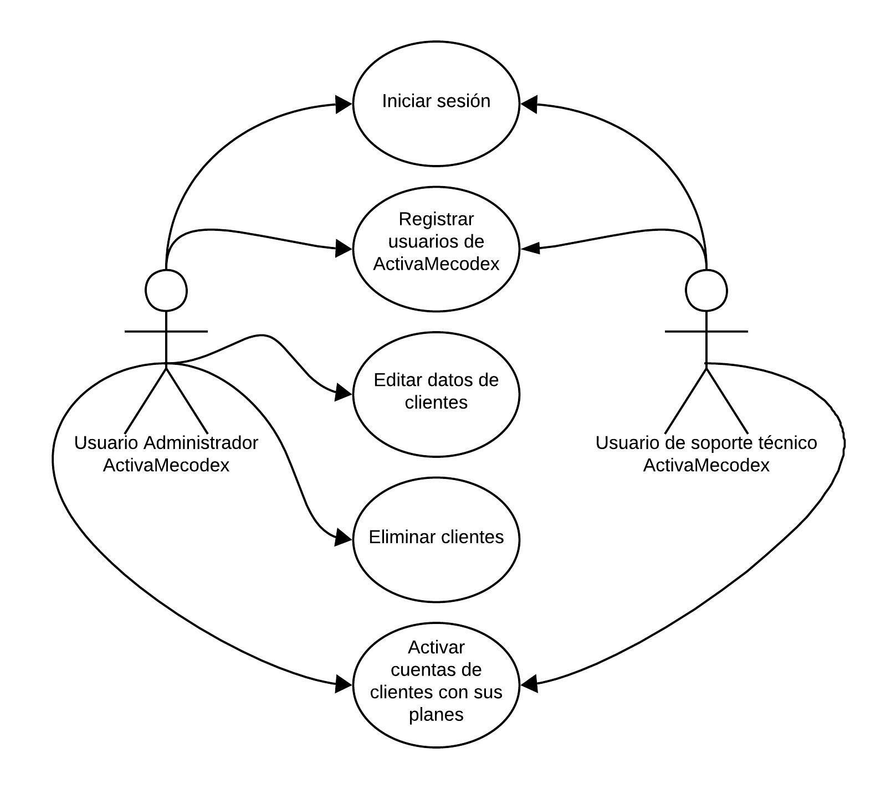
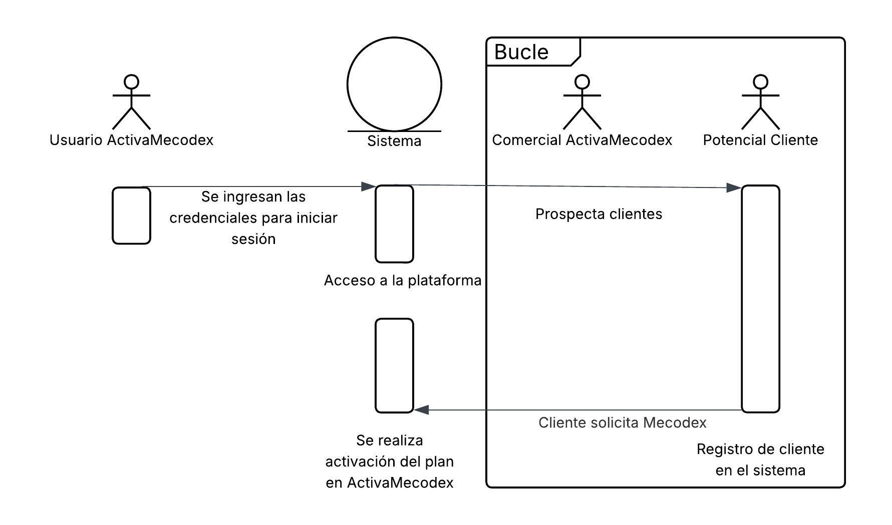
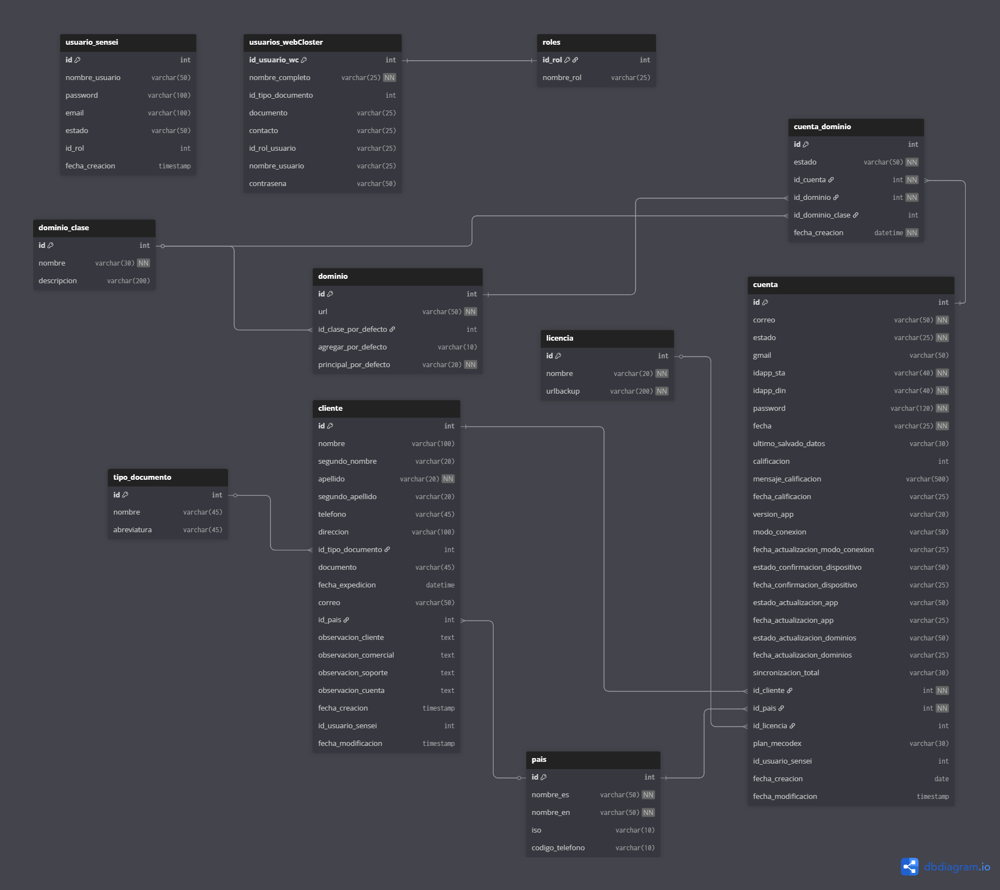

# ActivaMecodex: Gestión integral del ciclo de vida de usuarios

## Introducción

**ActivaMecodex** es una aplicación de gestión administrativa desarrollada por [WebCloster](https://webcloster.com/) que centraliza y automatiza los procesos de registro, activación y seguimiento de usuarios en la plataforma Mecodex. Diseñada específicamente para optimizar las operaciones internas de Mecodex, elimina la dependencia de procesos manuales basados en hojas de cálculo y archivos de texto como Word.

## El problema: Gestión manual

Actualmente, la administración de usuarios de Mecodex enfrenta desafíos operativos críticos:

- **Procedimientos manuales**: Activaciones, cobros y renovaciones se realizan manualmente, lo que aumenta el riesgo de errores y omisiones
- **Procesos fragmentados**: La información de usuarios se distribuye en hojas de Excel sin un punto centralizado de control
- **Errores y omisiones**: Activaciones olvidadas, cobros perdidos o fuera de fecha, y renovaciones vencidas que no se detectan a tiempo
- **Carga administrativa**: El equipo de desarrollo y administradores internos dedican tiempo valioso a tareas repetitivas de seguimiento y validación manual
- **Falta de visibilidad**: No existe un registro en tiempo real del estado de cada usuario, sus fechas de pago o vencimiento de plan
- **Riesgo financiero**: Pérdida de ingresos por cobros no realizados o no seguidos
- **Ausencia de reportes**: Imposibilidad de generar reportes automáticos sobre usuarios activos, vencidos e historial de transacciones

## Solución: ActivaMecodex

ActivaMecodex proporciona una plataforma centralizada que automatiza la gestión completa del ciclo de vida de usuarios, dirigida específicamente a administradores internos y soporte técnico de [WebCloster](https://webcloster.com/) y líderes de desarrollo de Mecodex.

### Funcionalidades principales

**Registro y gestión de usuarios**: Captura centralizada de información de nuevos usuarios con validación automática de datos.

**Automatización de activaciones**: Activación programada de planes según fechas de pago confirmadas, eliminando la intervención manual.

**Seguimiento de suscripciones**: Monitoreo en tiempo real de fechas de pago, renovaciones y vencimientos próximos con alertas automáticas.

**Reportes automáticos**: Generación de reportes detallados sobre usuarios activos, usuarios con planes vencidos, historial de pagos y análisis de renovaciones.

**Historial completo**: Registro auditable de cada usuario, transacción y cambio de estado para trazabilidad total.

## Beneficios para los procesos internos

- **Eficiencia operativa**: Gestión y manejo de los usuarios desde la app de RegistraMecodex
- **Cero errores administrativos**: Eliminación de activaciones olvidadas y cobros perdidos mediante automatización
- **Reportes automáticos**: Generación sin intervención manual de reportes de usuarios activos y vencidos, eliminando tareas administrativas repetitivas
- **Escalabilidad**: Capacidad de gestionar crecimiento de usuarios sin aumentar carga administrativa
- **Toma de decisiones informada**: Datos en tiempo real para identificar patrones, tasas de retención y oportunidades de mejora

## Público objetivo

ActivaMecodex está diseñada para:

- **Administradores internos de WebCloster**: Responsables de la gestión operativa de usuarios en Mecodex
- **Líderes de desarrollo de Mecodex**: Encargados de la activación y seguimiento de planes de usuarios

Ambos grupos se benefician de una herramienta que centraliza información, automatiza procesos y proporciona visibilidad en tiempo real sobre el estado de cada usuario y sus suscripciones.

## Requisitos Funcionales

- **Registro de usuarios**: Captura y validación de información de nuevos usuarios
- **Activación programada**: Activación automática de planes según fechas de pago confirmadas
- **Seguimiento de suscripciones**: Monitoreo en tiempo real de fechas de pago, renovaciones y vencimientos próximos
- **Reportes automáticos**: Generación de reportes detallados sobre usuarios activos, usuarios con planes vencidos, historial de pagos y análisis de renovaciones
- **Historial completo**: Registro auditable de cada usuario, transacción y cambio de estado para trazabilidad total

## Requisitos No Funcionales

- **Rendimiento**: Capacidad para manejar un alto volumen de usuarios y transacciones sin degradación en la velocidad de respuesta
- **Fiabilidad**: Garantía de que el sistema gestione eficientemente a los usuarios con el estado de sus cuentas, avisando de los estados de sus planes y suscripciones vencidas
- **Seguridad**: Protección de datos de usuarios y transacciones financieras mediante cifrado y autenticación segura
- **Escalabilidad**: Arquitectura diseñada para crecer con la expansión de la plataforma Mecodex y el aumento del número de usuarios
- **Disponibilidad**: Sistema operativo 24/7 con tiempo de actividad garantizado para minimizar interrupciones operativas

## Arquitectura del Sistema

<!-- Diagramas y descripción de la arquitectura tecnológica -->

## Tecnologías utilizadas en ActivaMecodex

A continuación se detallan las tecnologías y herramientas identificadas en la estructura del proyecto y sus archivos de configuración:

- **Frontend y framework**
  - Angular 20 (Angular CLI, componentes standalone, Angular Router)
  - Ionic Framework 8 (Ionic Angular) y Ionicons 7 para iconografía
  - TypeScript 5.8 como lenguaje principal
  - RxJS 7.8 para programación reactiva
  - Soporte SSR opcional mediante `@ionic/angular-server`

- **Backend**
  - PHP 8.2 para lógica del servidor y APIs

- **Base de datos**
  - Gestor de base de datos en PHPMyAdmin 5.2 para administración de bases de datos MySQL
  - MySQL 8.0 para almacenamiento de datos relacionales

- **Integración nativa (aplicaciones híbridas)**
  - Capacitor 7: `@capacitor/app`, `@capacitor/core`, `@capacitor/haptics`, `@capacitor/keyboard`, `@capacitor/status-bar`

- **Herramientas de desarrollo, build y configuración**
  - Angular CLI 20 y `@angular-devkit/build-angular`
  - Ionic CLI 7.2.1 para gestión de proyectos Ionic y generación de componentes
  - `@ionic/angular-toolkit` para integración de Ionic con Angular
  - Uso de señales *(Signals)* para estado reactivo y actualización eficiente de la interfaz
  - Gestión de proyecto y scripts a través de `package.json`

- **Linting y calidad de código**
  - ESLint 9 con `@angular-eslint` (builder, plugins y parser)
  - `@typescript-eslint` (plugin y parser) para análisis estático de TypeScript

- **Pruebas**
  - Karma (runner) y Jasmine (framework de pruebas)

- **Documentación del producto (sitio de docs)**
  - ***Docusaurus 3.9*** (React 19), configuración en `Mecodex docs/`
  - Soporte MDX para contenido enriquecido y ejemplos
  - TypeScript para tipado y tooling del sitio
  - Scripts de documentación: `docusaurus start`, `build`, `deploy`, `serve`

- **Gestión de dependencias y entorno**
  - npm como gestor de paquetes
  - Node.js (>= 20) requerido por el sitio de documentación *(Versión actual de node: **24.7.0**)*

## Lista de requerimientos

<!-- Requerimiento funcional usuario webcloster (RFUWC) -->

| Código | Requisito | Descripción |
|--------|-----------|-------------|
| RFUWC001 | Inicio de sesión | Permite a los usuarios registrados en ActivaMecodex, realizar el inicio de sesión en la aplicación para acceder a sus funcionalidades. |
| RFUWC002 | Registro de usuarios | Permite registrar usuarios para el uso de la aplicación, haciendo uso de sus datos básicos, y teniendo acceso a tráves de correo/usuario y contraseña |
| RFUWC003 | Permisos del sistema | Según los permisos que tengan los usuarios en ActivaMecodex, acceder a funcionalidades específicas basadas en su rol y permisos asignados. |
| RFUWC004 | Acciones en clientes | Permite a los usuarios del sistema realizar acciones sobre los clientes, como registrar, editar, desactivar, suspender o eliminar clientes de Mecodex según sus permisos otorgados. |
| RFUWC005 | Activación de cuentas | Permite a los usuarios del sistema activar las cuentas de los clientes con los planes que adquieran |
| RFUWC006 | Buscador de clientes | Permite buscar clientes por nombre, correo electrónico, plan que maneja o número de teléfono |
| RFUWC007 | Seguimiento de suscripciones | Monitoreo en tiempo real de fechas de pago, renovaciones y vencimientos próximos |
| RFUWC008 | Detalles del cliente | Visualización detallada de la información del cliente a un solo click, proporcionando más información al respecto. Modo de conexión, versión de la aplicación que usa, si ya está pago, calificación de la app, etc. |
| RFUWC009 | Eliminación de usuarios de ActivaMecodex | Permite a los usuarios administradores eliminar usuarios de ActivaMecodex, teniendo en cuenta que se debe eliminar también sus datos de la base de datos. |

## Caracterización de procesos

### **Caracterización de proceso**: RFUWC001: Inicio de sesión

**Descripción**: El usuario de la plataforma de ActivaMecodex ingresa sus credenciales de para iniciar sesión en el sistema y poder ingresar

- **Actores**:
  - Administrador
  - Soporte técnico
  - Ejecutivo comercial

**Requisitos**

Estar registrado en la plataforma de ActivaMecodex para el ingreso.

**Postcondiciones**

- El usuario ha ingresado correctamente a la plataforma de ActivaMecodex.
- El usuario tiene acceso a las funcionalidades y recursos disponibles para su rol.

**Flujo alternativo**

- Si el usuario no está registrado, se le redirige al registro.

---

### **Caracterización de proceso**: RFUWC002: Registro de usuarios

**Descripción**: El usuario administrador de la plataforma de ActivaMecodex ingresa los datos básicos del nuevo usuario para registrarlo en el sistema y poder acceder a sus funcionalidades según los permisos que le otorgue.

- **Actores**:
  - Administrador
  - Soporte técnico
  - Ejecutivo comercial

**Requisitos**

- El usuario debe proporcionar información básica como nombre, correo electrónico, número de teléfono y contraseña.
- El correo electrónico debe ser único y no puede estar registrado previamente.

**Postcondiciones**

- El usuario ha sido registrado exitosamente en la plataforma de ActivaMecodex.
- El usuario puede iniciar sesión utilizando sus credenciales de registro.

**Flujo alternativo**

- Si el usuario ya tiene una cuenta, se le redirige al inicio de sesión.

---

### **Caracterización de proceso**: RFUWC003: Permisos del sistema

**Descripción**: El usuario administrador de la plataforma de ActivaMecodex asigna permisos específicos a los usuarios registrados en el sistema, basados en su rol y responsabilidades dentro de la organización.

- **Actores**:
  - Administrador
  - Soporte técnico
  - Ejecutivo comercial

**Requisitos**

- El administrador debe tener acceso a la funcionalidad de asignación de permisos.
- El usuario a asignar permisos debe estar registrado previamente en la plataforma.

**Postcondiciones**

- El usuario ha sido asignado los permisos especificados por el administrador.
- El usuario puede acceder a las funcionalidades y recursos disponibles para su rol.

**Flujo alternativo**

- Si el usuario no está registrado previamente, se le redirige al registro.

---

### **Caracterización de proceso**: RFUWC004: Acciones en clientes

**Descripción**: Según los permisos que tenga el usuario de la plataforma de ActivaMecodex puede realizar diversas acciones sobre los clientes, como registrar, editar, desactivar, suspender o eliminar clientes de Mecodex.

- **Actores**:
  - Administrador
  - Soporte técnico
  - Ejecutivo comercial

**Requisitos**

- El usuario debe tener acceso a la funcionalidad de acciones en clientes.
- El usuario debe tener permisos suficientes para realizar la acción deseada sobre el cliente.

**Postcondiciones**

- La acción sobre el cliente ha sido realizada exitosamente.
- El estado del cliente ha sido actualizado en la base de datos.

**Flujo alternativo**

- El usuario no cuenta con los permisos suficientes para realizar acciones sobre los clientes.
- El usuario no está registrado y pasa a registrarse en el sistema.

---

### **Caracterización de proceso**: RFUWC005: Activación de cuentas

**Descripción**: Permite a los usuarios del sistema activar las cuentas de los clientes con los planes que adquieran.

- **Actores**:
  - Administrador
  - Soporte técnico
  - Ejecutivo comercial

**Requisitos**

- El usuario debe tener acceso a la funcionalidad de activación de cuentas.
- El cliente ya canceló el pago por su suscripción y se procede a realizar la activación de su cuenta.

**Postcondiciones**

- La cuenta del cliente ha sido activada exitosamente.

**Flujo alternativo**

- El usuario no tiene permisos para activar cuentas.
- El cliente no ha realizado el pago de su suscripción todavía.

---

### **Caracterización de proceso**: RFUWC006: Gestión de planes

**Descripción**: Permite a los usuarios del sistema gestionar los planes de suscripción que han adquirido, como cambiar, cancelar o extender los planes.

- **Actores**:
  - Administrador
  - Soporte técnico
  - Ejecutivo comercial

**Requisitos**

- El usuario debe tener acceso a la funcionalidad de gestión de planes.
- El usuario debe tener una cuenta activa con un plan suscrito.

**Postcondiciones**

- El plan del usuario ha sido actualizado exitosamente.
- El usuario puede acceder a las funcionalidades y recursos disponibles para su plan.

**Flujo alternativo**

- El usuario no tiene una cuenta activa con un plan suscrito.
- El usuario no está registrado y pasa a registrarse en el sistema.

---

### **Caracterización de proceso**: RFUWC007: Seguimiento de suscripciones

**Descripción**: Monitoreo en tiempo real de fechas de pago, renovaciones y vencimientos próximos para los planes de suscripción de los clientes.

- **Actores**:
  - Administrador
  - Soporte técnico
  - Ejecutivo comercial

**Requisitos**

- El usuario debe tener acceso a la funcionalidad de seguimiento de suscripciones.
- El cliente debe tener una cuenta activa con un plan suscrito.

**Postcondiciones**

- El usuario puede ver en tiempo real la información sobre sus suscripciones, como fechas de pago, renovaciones y vencimientos próximos.

**Flujo alternativo**

- El usuario no está registrado en el sistema.

---

### **Caracterización de proceso**: RFUWC008: Eliminación de usuarios de ActivaMecodex

**Descripción**: Permite a los usuarios administradores eliminar usuarios de ActivaMecodex, teniendo en cuenta que se debe eliminar también sus datos de la base de datos.

- **Actores**:
  - Administrador

**Requisitos**

- El usuario administrador debe tener acceso a la funcionalidad de eliminación de usuarios.

**Postcondiciones**

- El usuario ha sido eliminado exitosamente de ActivaMecodex.
- Los datos del usuario eliminado han sido eliminados de la base de datos.

**Flujo alternativo**

- El usuario no tiene permisos suficientes para eliminar usuarios.
- El usuario no está registrado en el sistema.

---

## Diagramas UML

<!-- Escenarios de interacción entre usuarios y el sistema -->
### Diagrama de Casos de Uso

### Diagrama de Casos de secuencia

## Diseño de Base de Datos

<!-- Modelo de datos, esquemas y relaciones -->
A continuación, se presenta el Modelo Entidad Relación (MER) de la base de datos de Mecodex:

Para mas detalle al respecto y mejor visualización, puede consultar el siguiente link: [Modelo Entidad Relación (MER) de la base de datos de Mecodex](https://dbdiagram.io/d/mer_mecodex-6905190d6735e11170b84c4d)

## API y Endpoints

<!-- Documentación de servicios y interfaces de programación -->

## Diseño de Interfaz de Usuario

<!-- Wireframes, flujos de navegación y diseño visual -->

## Configuración y Despliegue

<!-- Instrucciones de instalación y configuración del sistema -->

## Mantenimiento y Operaciones

<!-- Procedimientos de mantenimiento, monitoreo y backup -->

## Plan de Pruebas

<!-- Estrategias y casos de prueba para validar el sistema -->

## Seguridad

<!-- Medidas de seguridad, control de acceso y protección de datos -->

## Glosario de Términos

<!-- Definiciones de términos técnicos y conceptos del dominio -->

## Referencias y Anexos

<!-- Documentación adicional y recursos de referencia -->