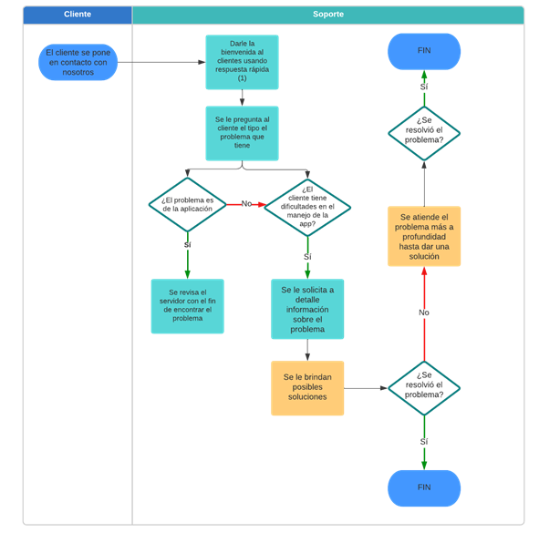

# Manual de funciones del área de soporte de Mecodex

# WEBCLOSTER S.A.S

## 1. INFORMACIÓN GENERAL

- **Unidad:** Área de Soporte Mecodex
- **Puesto Actual:** Soporte técnico
- **Superiores Inmediatos:** Directora Operativa y Gerente General

## 2. OBJETIVO GENERAL

Prestar asistencia técnica a los clientes en el manejo de las aplicaciones actuales y futuras de la Empresa. Participar en el mantenimiento del Software del Sistema de Información de la entidad, sugiriendo alternativas de mejoramiento enmarcadas en las directrices que fije Webcloster respecto a sus recursos informáticos.

## 3. DESCRIPCIÓN DE PRINCIPALES RESPONSABILIDADES

1. Aprender y entender el funcionamiento de las aplicaciones producidas en Webcloster con el fin de brindar a los clientes una excelente asesoría.

2. Dar asistencia técnica a los clientes a través de los medios de contacto (WhatsApp, Tawk, Anydesk, Telegram y llamadas telefónicas).

3. Participar en la construcción de estrategias de venta de acuerdo con las necesidades del área.

4. Realizar el mantenimiento al software y equipos de Webcloster de acuerdo con los parámetros establecidos para el manejo de estos recursos.

5. Acatar las disposiciones de carácter general o específico emitidas por las autoridades superiores.

## 4. PROCESO DE ATENCIÓN A CLIENTES CON ALGÚN PROBLEMA

## 5. RESPUESTAS RÁPIDAS A USAR

### Activación de Cuenta

Estas respuestas las podrá encontrar en el teléfono designado al área:

**Para clientes nuevos:**
- "¡Hola! Mi nombre es [nombre] del equipo Mecodex **área de Soporte Técnico**. Procederé a iniciar el proceso de activación de su cuenta 🚀. Este procedimiento tiene una duración estimada de entre 5 y 15 minutos."

**Confirmación de activación:**
- "👷 Sr.(a) [nombre], le informo que su cuenta ha sido activada con éxito."

**Enlace de descarga:**
- "📱📋💰 Datos de descarga de la Aplicación contable MECODEX
  👉 Para instalar Mecodex ve al siguiente link e instala la aplicación: https://play.google.com/store/apps/details?id=com.webcloster.mecodex2"

**Acceso web:**
- "Para acceder a Mecodex en su versión Web, por favor ingresa al siguiente link: https://web.mecodex.com
  Luego ingresa con:
  - Usuario: xxxx
  - Contraseña: 1234"

### Flujo de activación según estado del cliente

**Cliente ya descargó la App:**
- "¡Hola! 👋🏻 Mi nombre es [nombre] del equipo Mecodex **área de Soporte Técnico** 👷🏻‍♂️. Procederé a iniciar el proceso de activación de su cuenta 🚀. Este procedimiento tiene una duración estimada de entre 5 y 15 minutos.🕐 Se le notificará tan pronto el proceso haya finalizado. ✅"

**Cliente no ha descargado la App:**
- "A continuación, le enviaré el link de descarga de la app. 👉 Para instalar Mecodex ve al siguiente link e instala la aplicación: https://play.google.com/store/apps/details?id=com.webcloster.mecodex2, quedo al pendiente de su confirmación de descarga para continuar con el proceso de activación."

### Respuestas específicas por funcionalidad

**Super clave:**
- "👤 **¿Cómo generar o cambiar tu super clave?** 🗝️
  Como administrador tienes acceso a una Super-clave la cual te servirá para editar y eliminar registros de ventas, compras, productos, entre otros.
  
  Para generarla debes dirigirte al menú lateral → Ajustes → Generar super clave. (Esta te llegará al correo electrónico) 📧. Esto para confirmar si el usuario que está generando la Super-clave es el usuario propietario de la App.
  
  🔄 Si deseas cambiar tu super clave deberás dar clic en 👉Cambiar super clave. Solo te pedirá poner la clave anterior y la clave nueva. ✅"

**Venta de productos:**
- "💰💳 **¿Cómo vender un producto o servicio?**
  🔔 Para realizar una venta primero debes tener creados tus productos o servicios.
  
  Una vez realizado, te diriges al menú principal, luego ventas 👉 Das Clic en el botón más➕, llenas los datos y agregas el producto o servicio que vas a vender: clic en más➕, selecciona cantidad y por último das clic en guardar. 🔐
  
  🔔 **Nota:** Si registraste tus productos con código de barras al momento de realizar la venta puedes seleccionar el producto escaneándolo."

**Creación de productos:**
- "🍅💆 **¿Cómo crear un producto o servicio?**
  Te diriges al menú principal, luego ingresas en **Inventario** 🧾. Das Clic en el botón más➕ y llenas los datos de tu producto o servicio (nombre, cantidad, precio, etc.) para finalizar das clic en 👉 **guardar**🔐"

**Mensajes de cierre:**
- "¡Con mucho gusto! Cualquier consulta no dude en contactarnos. Estamos para servirle. 📲 **Feliz día** ☀️"
- "Buen día/tarde 🤗 Sr(a). [nombre]. Podría por favor informarme cuál es la duda que tiene para ayudarle a resolverla. 😊"
- "Hola **[Nombre del Cliente]** 👋, ¡Espero que estés teniendo un día increíble! 🌟 Solo quería tomar un momento para preguntarte ¿cómo te ha ido utilizando la App o (plataforma web)?, ¿tienes alguna duda o inquietud? 🚀 Estamos aquí para ayudarte en todo lo que necesites y asegurarnos de que tengas la mejor experiencia. 💼"

**Actualizaciones:**
- "¡Grandes noticias! 🎉 Ya está disponible una nueva actualización de nuestra app Mecodex. 🥳 Estamos emocionados de compartir las mejoras y nuevas funciones que hemos añadido para hacer tu experiencia aún mejor. 👌
  
  📲 **¡Actualiza ahora y descubre todo lo nuevo que tenemos para ti!**
  
  👉 Para actualizar Mecodex ve al siguiente link y pulsa en el botón de Actualizar: https://play.google.com/store/apps/details?id=com.webcloster.mecodex2&pli=1"

## 6. POSIBLES ESCENARIOS QUE SE PUEDEN PRESENTAR

### Pantalla inicio

**Problema: Se cae el internet y la aplicación no funciona**

- La aplicación sí funciona sin internet, si la aplicación está instalada en móvil, no utilizando en modo web.
- **Aplicación en el móvil:** Una vez descargada, puede funcionar sin conexión a Internet, ya que almacena los datos necesarios en el dispositivo.
- **Aplicación en web:** Requiere conexión a Internet para funcionar, ya que depende de los servidores en línea para cargar y procesar la información.

**Problema: Qué hacer si un producto ya se vendió y aún aparece en inventario**

- Ingresa a compras → ingresas a la primera compra que hayas realizado sobre ese producto → le das clic en editar → ingresas la super clave y le das guardar sin hacer ningún cambio, ya que está función debería de recalcular la existencia del producto y después verificas si ya no te aparece el **error**.

**Problema: Necesito que en el computador quede de administrador y en el móvil como lector**

- Lector solo sirve en la web, **NO puedes ingresar como lector en la App Móvil** y para ingresar como administrador en ambos lados, debes primero ingresar en la web y ahí ingresar en el dispositivo móvil desde el navegador (Para acceder a este proceso se debe de ingresar con usuario y contraseña).

**Problema: ¿Dónde agrego el total de efectivo que tengo?**

- Lo agregas en el apartado de **entrada y salidas** → lo ingresas como un ingreso.

**Problema: Qué sucede si la App de Mecodex en modo administrador no te quiere abrir en dos dispositivos**

- La App en modo administrador solo se puede tener en **un dispositivo a la vez**, sea en móvil o en web. Si se tiene abierto en móvil y lo necesitas en web debes de cerrar sesión en el dispositivo que se encuentre abierto y ahí debes ingresarlo en el dispositivo que lo necesites.

**Problema: No me da el cuadre de caja**

Razones por las que esto podría estar sucediendo en la app de Mecodex:

1. **Configuraciones incorrectas:** Revisa las configuraciones de la app para asegurarte de que todo esté ajustado correctamente según tus necesidades.
2. **Sincronización de datos:** Verifica que la app esté sincronizando correctamente los datos con la nube. A veces, una sincronización fallida puede causar problemas.
3. **Actualizaciones pendientes:** Asegúrate de que la app esté actualizada a la última versión. Las actualizaciones pueden corregir errores y mejorar la funcionalidad.
4. **Errores de entrada:** Asegúrate de que todos los datos ingresados sean correctos y completos. Un solo error puede causar un desajuste.

**Resumen de modos de acceso:**
- **Lector:** Se puede tener en los dispositivos que lo necesite (Solo en modo web).
- **Administrador:** Se puede tener en un solo dispositivo sea móvil o web.

**Nota importante:** El registro se inicia por la app descargada en móvil, y al hacer el registro para ingresar **por primera vez en modo web debes de escanear el código QR desde el teléfono.**

## 7. PROCESO DE ACTIVACIÓN SEGÚN EL PLAN

**Plan Lite:**
- Descargar la Aplicación → crea el registro → confirma el correo y procede hacer el login (ingresar por primera a la aplicación)

**Plan Pro:**
- Descargar la Aplicación → crea el registro → confirma el correo → Informar a Desarrollo para que realice la activación del plan → proceder hacer el login
- Verificar que existan los respaldos automáticos → ingresar a respaldo de datos → respaldo automático de la base de datos

**Plan Plus Web:**
- Descargar la Aplicación → crea el registro → confirma el correo → Informar a Desarrollo para que realice la activación del plan → proceder a hacer el login
- Verificar que existan los respaldos automáticos → ingresar a respaldo de datos → respaldo automático de la base de datos → Ir al navegador desde el pc y desde la aplicación móvil escanear el código Qr para realizar estos pasos → (Ir al menú lateral en la parte superior de la app, ingresar a Mecodex WEB, vincular dispositivo) después de realizar los pasos desinstalar la Aplicación móvil.

**Plan Pro Plus:**
- Descargar la Aplicación → crea el registro → confirma el correo → Informar a Desarrollo para que realice la activación del plan → proceder hacer el login
- Verificar que existan los respaldos automáticos → ingresar a respaldo de datos → respaldo automático de la base de datos → Ir al navegador desde el pc y desde la aplicación móvil escanear el código Qr para realizar estos pasos → (Ir al menú lateral en la parte superior de la app, ingresar a Mecodex WEB, vincular dispositivo)

**Tutorial según preferencia del cliente:**
Preguntar al cliente, con qué modo desea iniciar su tutorial, sea (Móvil o Web):

- Si el cliente desea iniciar con la web, debe indicarle al cliente que ingrese por el navegador a https://mecodex.com/ y realice el login con el usuario y contraseña.
- Si el cliente quiere iniciar en modo móvil, debe de cerrar sesión en la web, desde el teléfono, e informarle al cliente que instale la aplicación desde Google PLAY, para que inicie con usuario y contraseña.

## 8. PROBLEMAS TÉCNICOS ESPECÍFICOS

**Problema: Al recuperar la cuenta muestra el mensaje "error de recuperación de datos >> tabla usuario vacía en servidor"**

- Si es una cuenta recién creada y no se ha realizado el proceso de salvado de datos no te permitirá recuperar, se debe de ingresar y realizar el proceso de salvado de datos. En caso que no permita.

**Problema: Al intentar ingresar muestra el mensaje de datos de acceso incorrectos**

- Verificar que los datos que se estén ingresando sean los mismos con los cuales muestra en el sensei, si son diferentes indicar que presione el botón sync que se encuentra en la parte superior derecha de la pantalla, verificar los datos de acceso y verificar que sean los correctos.
- Llegado el caso en que sean los mismos datos y aun así no le permite ingresar, se debe de ingresar en la cuenta del administrador y verificar que los datos de acceso no presenten espacios en blanco antes o después. Si presenta estos espacios eliminarlos y se le indica al cobrador que presione el botón sync.

**Cambio de dispositivo móvil:**
- Antes de cambiar a un nuevo dispositivo móvil es importante que realicen el **proceso de salvado de datos para que toda la información quede guardada**. Luego deberá recuperar cuenta en el dispositivo nuevo, podrá ingresar normalmente con las credenciales que le fue asignada.

**Fecha incorrecta:**
- Este inconveniente se presenta cuando la fecha del teléfono fue modificada ya sea para una fecha antigua o una fecha futura. Tener en cuenta de verificar que la configuración del teléfono esté correcta y luego sincronizar desde el botón sync para poder ingresar.

## 9. ENTREGABLES

A. **Informes:** Realizar en el Webdesk informes diarios de trabajo sobre los casos presentados en el día junto con un resumen de los casos resueltos.

B. **Bitácora:** Realización y entrega de una bitácora semanal de trabajo la cual permita hacer un seguimiento de todos los casos presentados en el área.

C. **Retroalimentación:** Antes del cambio de turno se debe de efectuar una retroalimentación que permita conocer el estado de los casos que se han presentado. Esta retroalimentación se debe hacer ante el asesor comercial y la persona de soporte que recibe.

## 10. CONDICIONES AMBIENTALES Y ORGANIZACIONALES

**a. Formas de trabajo:**
- Trabajar en forma individual, pero en coordinación con los compañeros de trabajo y con su superior jerárquico inmediato.

**b. Condiciones de Trabajo:**
- Le corresponde trabajar en jornada ordinaria, trabaja en condiciones ambientales normales; la mayor parte de la jornada, trabaja sentado/a. En ciertos momentos laborales bajo presión, por lo que debe estar en capacidad para manejar dichas situaciones.

## 11. RESPONSABILIDADES

**a. Por actividades:**
- La responsabilidad del ocupante del cargo es efectuar labores de soporte a través de WhatsApp, con el propósito de lograr los objetivos establecidos, a través de un excelente servicio al cliente. Su trabajo se basa en procedimientos e instrucciones claramente establecidos.

**b. Supervisión recibida:**
- Trabaja con alguna independencia siguiendo instrucciones verbales y de tipo general de la Directora Operativa y Gerente General, de quienes depende. Su trabajo se basa en procedimientos previamente establecidos, aplicables a su actividad.
- Su labor es evaluada mediante la observación de los resultados obtenidos.

**c. Relaciones de trabajo:**
- Se relaciona internamente con el Asesor Comercial, el Área de Cartera y con los colaboradores de las otras unidades organizativas, cuando fuese necesario. Externamente se relaciona con los clientes que adquieren las aplicaciones a través de las líneas de atención de la empresa y solicitan soporte técnico.

**d. Por equipo y valores:**
- Es responsable por el adecuado uso del equipo de cómputo y móvil que serán asignados a su labor. Debe velar por el buen trato hacia los clientes y hacia los compañeros de trabajo.
- Los equipos usados por la persona designada en el área comercial serán entregados a ella mediante **Acta de Entrega** firmada por el Gestor Operativo donde se especificará el estado de los equipos y el número de equipos que serán entregados.

**e. Por Errores:**
- Los errores cometidos en la realización de su trabajo, pueden causar pérdidas económicas y afectaciones sobre la imagen de la empresa, por lo que las actividades deben realizarse con sumo cuidado y precisión.

## 12. REQUISITOS

**Nivel Académico:** Técnico o Tecnólogo en Sistemas.

## 13. OTROS CONOCIMIENTOS Y/U OTROS REQUISITOS

- Comunicación asertiva
- Disposición para el trabajo en equipo
- Conocimientos en paquetes de cómputo en uso de la Empresa
- Conocimientos en soporte
- Dominio sobre herramientas tecnológicas (Teléfono móvil y Computador)

## 14. COMPETENCIAS Y NIVELES DE DESARROLLO

### Sensibilidad social

Capacidad de identificarse con las necesidades de otras personas o grupos de personas en el cumplimiento de los objetivos institucionales:

- Comprende los intereses de sus compañeros de trabajo, clientes con los que se relaciona directamente -dentro de las normas de la organización- y los ayuda a resolver problemas que le plantean o se adelanta a atender problemas que observa por sí mismo/a.

### Compromiso

- Sentir como propios los objetivos de Webcloster S.A.S, apoyar e instrumentar decisiones para el completo logro de los mismos.
- Comprende la relación existente entre los objetivos del área y los institucionales. Ejecuta las acciones requeridas para el correcto funcionamiento de la unidad. Comprende y se compromete con la misión, visión, valores y objetivos estratégicos de Webcloster S.A.S.

### Orientación por resultados

Es la capacidad de encaminar éticamente todos los actos al logro de los objetivos institucionales, administrando los procesos establecidos, fijando metas desafiantes por encima de los estándares en el marco de las estrategias de Webcloster S.A.S.

- Actúa para lograr y superar estándares de desempeño y plazos establecidos, fijándose para sí los parámetros a alcanzar. Trabaja con objetivos claramente establecidos, realistas y desafiantes. Utiliza indicadores de gestión para medir y comparar los resultados obtenidos.

### Trabajo en equipo

Capacidad de colaborar con los demás, de formar parte de un grupo y de trabajar juntos en procesos, tareas u objetivos compartidos. Se basa en la comunicación, motivación, respeto mutuo y confianza. Con congruencia entre acciones, conductas y palabras. Asumiendo la responsabilidad de su propio trabajo y de sus errores.

- Solicita la opinión al resto del grupo. Valora sinceramente las ideas y experiencia de los demás; mantiene una actitud abierta para aprender de los otros e incluso sus pares. Promueve la colaboración de los distintos equipos, dentro de ellos y entre ellos. Valora las contribuciones de los demás, aunque tengan diferentes puntos de vista.

### Iniciativa

Predisposición a actuar de forma adelantada ante una situación. Implica marcar el rumbo con proactividad por medio de acciones concretas. Los niveles de actuación van desde concretar decisiones tomadas en el pasado hasta la búsqueda de nuevas oportunidades o soluciones de problemas.

- Toma decisiones en momentos de crisis, tratando de anticiparse a las situaciones que puedan surgir. Actúa rápida y decididamente en una crisis, en lugar de esperar, analizar y ver si se resuelve sola. Tiene distintos enfoques para enfrentar un problema.

### Orientación al cliente

Actitud y conducta sustentada en la justicia de servir a los clientes, de comprender y satisfacer sus necesidades, aun aquéllas no expresadas. Implica esforzarse por conocer y resolver los problemas del cliente de modo que se consideren sus necesidades para incorporar este conocimiento a la forma específica de planificar la actividad, velando siempre por el cumplimiento de las políticas organizacionales.

- Busca permanentemente resolver las necesidades de sus clientes anticipándose a sus pedidos o solicitudes. Propone acciones dentro de su organización para lograr la satisfacción de los clientes.

### Integridad

Compromiso con la honestidad y la confianza en cada faceta de la conducta. Asumir la responsabilidad de sus propios errores. Establecer relaciones basadas en el respeto mutuo y la confianza. Ser realista y franco.

- Es honesto y responsable en relación con la normativa institucional y en sus actuaciones sociales. Conoce, respeta y practica los valores y normas de trabajo. Establece relaciones basadas en el respeto y la confianza. Existe una correlación entre su discurso y su accionar.

## 15. ORGANIZACIÓN

- **Titular del Puesto:** Soporte técnico
- **Jefes inmediatos:** Directora Operativa y Gerente General

---